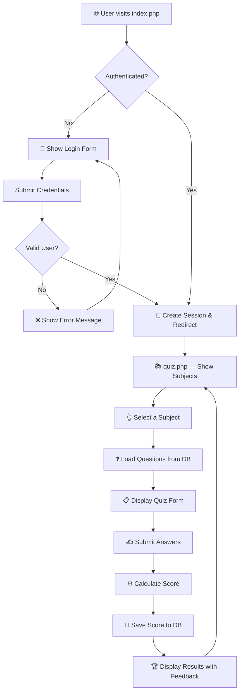
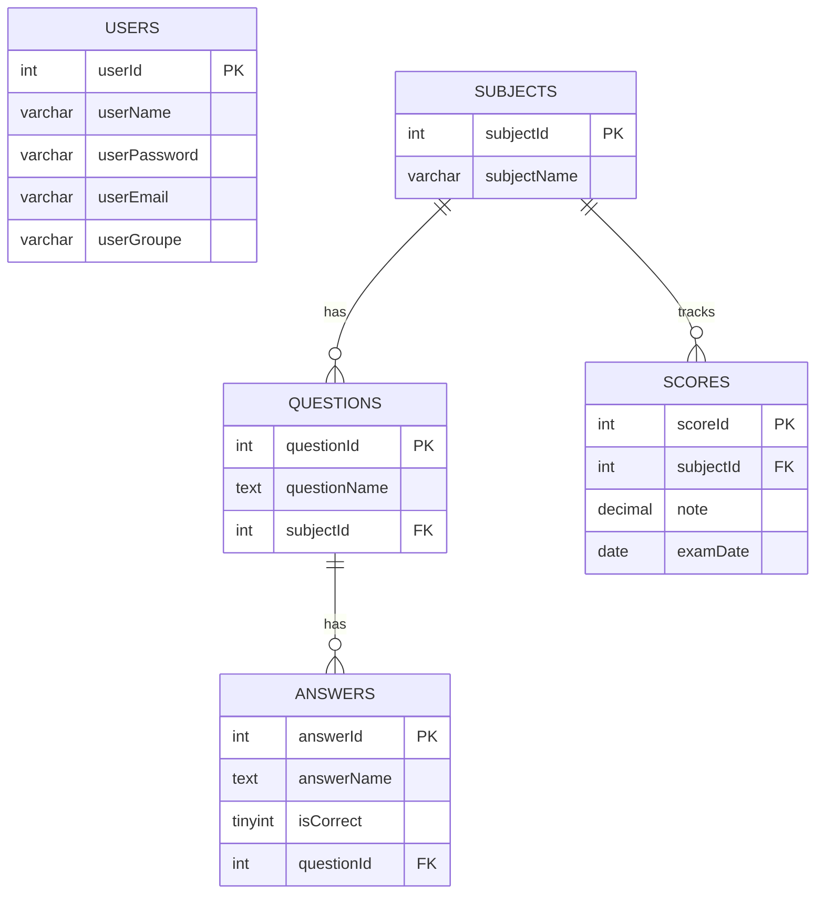

<p align="center">
  
</p>

<h1 align="center">🎓 Quiz Academy</h1>

<p align="center">
  <strong>An interactive PHP quiz platform with dynamic question loading, real-time scoring, and a modern glassmorphism UI.</strong>
</p>

<p align="center">
  <a href="#features"></a>
  <a href="#tech-stack"></a>
  <a href="#tech-stack"></a>
  <a href="#tech-stack"></a>
  <a href="https://github.com/YassirKz/QuizAcademy/blob/main/LICENSE"></a>
</p>

---

## 📖 About

**Quiz Academy** is a full-stack PHP web application that provides a dynamic quiz experience for students and educators. Users authenticate via a secure login system, select from multiple subjects, answer questions loaded dynamically from a MySQL database, and receive instant scored feedback with visual highlights of correct and incorrect answers. Results are persisted for tracking performance over time.

---

## ✨ Features

| Feature | Description |
|---------|-------------|
| 🔐 **Secure Authentication** | Session-based login with prepared statements (SQL injection protection) |
| 📚 **Dynamic Subjects** | Subjects are fetched from the database — add new topics without code changes |
| ❓ **Question Engine** | Multiple-choice questions with randomized answer options per subject |
| ✅ **Instant Scoring** | Real-time score calculation on submission with percentage display |
| 🎨 **Visual Feedback** | Green/red highlights with ✓/✗ icons for correct/incorrect answers |
| 💾 **Score Persistence** | Results saved to database with date tracking for grade analytics |
| 👤 **User Profile** | Displays user email, group info, and personalized welcome |
| 📱 **Responsive Design** | Fully responsive layout adapting to mobile, tablet, and desktop |

---

## 🖼️ Screenshots

<table>
  <tr>
    <td align="center"><strong>Login Page</strong></td>
    <td align="center"><strong>Quiz Interface</strong></td>
  </tr>
  <tr>
    <td></td>
    <td></td>
  </tr>
</table>

> The login page features a **glassmorphism** design with animated gradients, while the quiz interface offers a clean card-based layout with intuitive subject selection.

---

## 🏗️ Architecture

```
quizAcademy/
├── index.php          # Login page — authentication & session management
├── quiz.php           # Quiz engine — question rendering, scoring & results
├── connexion.php      # PDO connection, session config, security headers & CSRF helpers
├── logout.php         # Secure session destruction & logout
├── migration.sql      # Database migration for security upgrades
├── style/
│   ├── login.css      # Glassmorphism login UI with animations
│   └── style.css      # Quiz interface — cards, buttons, responsive layout
├── images/
│   ├── Q-A.png        # App logo / favicon
│   ├── Logo.png       # Alternate logo
│   └── Q-A_Logo.png   # Compact logo variant
└── README.md
```

### Application Flow



---

## 🗄️ Database Schema

The application uses a **MySQL** database named `quizacademy` with the following structure:

```sql
-- Users table
CREATE TABLE users (
    userId      INT AUTO_INCREMENT PRIMARY KEY,
    userName    VARCHAR(100) NOT NULL UNIQUE,
    userPassword VARCHAR(255) NOT NULL,
    userEmail   VARCHAR(255),
    userGroupe  VARCHAR(100)
);

-- Subjects table
CREATE TABLE subjects (
    subjectId   INT AUTO_INCREMENT PRIMARY KEY,
    subjectName VARCHAR(255) NOT NULL
);

-- Questions table
CREATE TABLE questions (
    questionId   INT AUTO_INCREMENT PRIMARY KEY,
    questionName TEXT NOT NULL,
    subjectId    INT NOT NULL,
    FOREIGN KEY (subjectId) REFERENCES subjects(subjectId)
);

-- Answers table
CREATE TABLE answers (
    answerId    INT AUTO_INCREMENT PRIMARY KEY,
    answerName  TEXT NOT NULL,
    isCorrect   TINYINT(1) DEFAULT 0,
    questionId  INT NOT NULL,
    FOREIGN KEY (questionId) REFERENCES questions(questionId)
);

-- Scores table
CREATE TABLE scores (
    scoreId    INT AUTO_INCREMENT PRIMARY KEY,
    subjectId  INT NOT NULL,
    note       DECIMAL(5,2) NOT NULL,
    examDate   DATE NOT NULL,
    FOREIGN KEY (subjectId) REFERENCES subjects(subjectId)
);
```

### Entity Relationship



---

## 🛠️ Tech Stack

| Layer | Technology | Purpose |
|-------|-----------|---------|
| **Backend** | PHP 8.x | Server-side logic, authentication, quiz engine |
| **Database** | MySQL / MariaDB | Data persistence (via PDO with prepared statements) |
| **Frontend** | HTML5 + CSS3 | Semantic markup & modern styling |
| **Styling** | Custom CSS | Glassmorphism, gradients, animations, responsive design |
| **Fonts** | Google Fonts (Poppins) | Clean, modern typography |
| **Icons** | Font Awesome 6 | UI icons throughout the interface |
| **Server** | XAMPP (Apache) | Local development environment |

---

## 🚀 Getting Started

### Prerequisites

- [XAMPP](https://www.apachefriends.org/) (or any Apache + PHP + MySQL stack)
- PHP 8.0+ (uses `str_starts_with`, `password_hash`, named arguments)
- MySQL 5.7+ or MariaDB 10.x+

### Installation

1. **Clone the repository**
   ```bash
   git clone https://github.com/YassirKz/QuizAcademy.git
   ```

2. **Move to your web server directory**
   ```bash
   # For XAMPP on Windows:
   mv QuizAcademy C:\xampp\htdocs\quizAcademy

   # For XAMPP on macOS/Linux:
   mv QuizAcademy /opt/lampp/htdocs/quizAcademy
   ```

3. **Create the database**
   - Open phpMyAdmin at `http://localhost/phpmyadmin`
   - Create a new database named **`quizacademy`**
   - Import the SQL schema above, or run the `CREATE TABLE` statements manually

4. **Seed sample data**
   ```sql
   -- Add a subject
   INSERT INTO subjects (subjectName) VALUES ('General Knowledge');

   -- Add a question
   INSERT INTO questions (questionName, subjectId) VALUES ('What is the capital of France?', 1);

   -- Add answers (mark one as correct)
   INSERT INTO answers (answerName, isCorrect, questionId) VALUES ('London', 0, 1);
   INSERT INTO answers (answerName, isCorrect, questionId) VALUES ('Paris', 1, 1);
   INSERT INTO answers (answerName, isCorrect, questionId) VALUES ('Berlin', 0, 1);
   INSERT INTO answers (answerName, isCorrect, questionId) VALUES ('Madrid', 0, 1);

   -- Add a user
   INSERT INTO users (userName, userPassword, userEmail, userGroupe)
   VALUES ('admin', 'admin123', 'admin@quiz.com', 'Group A');
   ```

5. **Configure database connection** (if needed)

   Edit `connexion.php`:
   ```php
   $host = 'localhost';
   $dbName = 'quizacademy';
   $dbUsername = 'root';
   $dbPassword = '';  // Set your MySQL password if applicable
   ```

6. **Launch the application**
   - Start Apache and MySQL in XAMPP
   - Navigate to `http://localhost/quizAcademy/`
   - Login with your seeded credentials

---

## 🔒 Security

| Concern | Status | Implementation |
|---------|--------|----------------|
| SQL Injection | ✅ Protected | PDO prepared statements with `EMULATE_PREPARES = false` |
| Password Hashing | ✅ Protected | `password_hash()` (bcrypt) + auto-upgrade from plain text |
| XSS Prevention | ✅ Protected | `htmlspecialchars()` on all outputs |
| CSRF Protection | ✅ Protected | Token-based validation on all forms |
| Session Fixation | ✅ Protected | `session_regenerate_id(true)` on login |
| Session Cookies | ✅ Hardened | `httponly`, `samesite=Strict`, `strict_mode` |
| Brute Force | ✅ Protected | Rate limiting (5 attempts → 5 min lockout) |
| HTTP Headers | ✅ Set | `X-Content-Type-Options`, `X-Frame-Options`, `X-XSS-Protection` |
| Logout | ✅ Implemented | Full session destruction + cookie removal |
| Score Integrity | ✅ Linked | Scores tied to authenticated `userId` |

> **Note:** Run `migration.sql` in phpMyAdmin to apply the database schema changes (adds `userId` to scores, expands password column for bcrypt).

---

## 🗺️ Roadmap

- [x] 🔑 Password hashing with `bcrypt`
- [x] 🛡️ CSRF token protection on all forms
- [x] 🔐 Session hardening & logout
- [x] 🚫 Brute force rate limiting
- [ ] 📊 Student dashboard with score history & analytics
- [ ] ⏱️ Timed quizzes with countdown timer
- [ ] 🎲 Randomized question order
- [ ] 👨‍🏫 Admin panel for managing subjects, questions & answers
- [ ] 📤 Export results to CSV/PDF
- [ ] 🌙 Dark mode toggle
- [ ] 🌍 Multi-language support (FR/EN/AR)

---

## 🤝 Contributing

Contributions are welcome! Here's how:

1. **Fork** the repository
2. **Create** a feature branch: `git checkout -b feature/amazing-feature`
3. **Commit** your changes: `git commit -m 'Add amazing feature'`
4. **Push** to the branch: `git push origin feature/amazing-feature`
5. **Open** a Pull Request

---

## 📝 License

This project is open source and available under the [MIT License](LICENSE).

---

## 👤 Author

**Yassir Kz** — [@YassirKz](https://github.com/YassirKz)

---

<p align="center">
  Made with ❤️ for education
</p>
